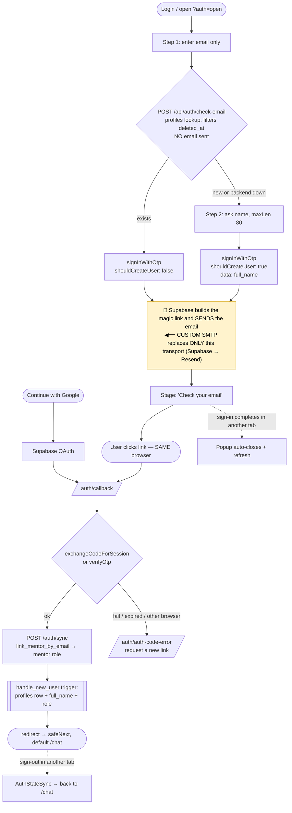

# Login flow (baseline) — and where custom SMTP fits

This is the authoritative login flow after the hardening fixes. **Custom SMTP changes
only the shaded "email delivery" node — every decision node is unchanged.** Full
edge-case matrix: [auth-edge-cases.md](./auth-edge-cases.md).

## Invariants — must stay true so the flow above is preserved
Custom SMTP does **not** require touching any of these. Do **not** change them while
setting up SMTP:

1. **No app code changes.** SMTP is 100% Supabase dashboard + DNS.
2. **Email template keeps `{{ .ConfirmationURL }}`.** This is the same-browser (PKCE)
   link we chose. Do NOT switch it to `{{ .TokenHash }}` (that would silently flip us
   to the cross-device behaviour we decided against).
3. **"Confirm email" stays ON.** It's what makes email the unique identity and enables
   automatic same-email account linking (Google ↔ magic link).
4. **`emailRedirectTo` / callback / `/auth/sync` / `check-email` untouched.**

## Supabase toggles — what to change vs leave
| Setting | Action |
|---|---|
| SMTP Settings → **Enable Custom SMTP** | ✅ turn ON (this task) |
| **Confirm email** | leave **ON** |
| Allow new users to sign up | leave **ON** |
| Allow manual linking | leave **OFF** (optional future "connect Google" button) |
| Allow anonymous sign-ins | leave **OFF** |
| Auth → **Rate Limits → emails** | raise from the tiny built-in cap once SMTP is on |

## Setup steps (dashboard + DNS, no deploy)
1. **Resend → Domains** → add & verify a (sub)domain, e.g. `send.immigroov.com`
   (add the MX + SPF + DKIM DNS records Resend shows).
2. **Supabase → Authentication → Emails → SMTP Settings → Enable Custom SMTP:**
   - Host `smtp.resend.com` · Port `465` (SSL) or `587` (TLS)
   - Username `resend` · Password = your **Resend API key**
   - Sender email `noreply@send.immigroov.com` · Sender name `Immigroov`
3. **Auth → Rate Limits** → raise the email rate limit (default jumps to ~30/hr with
   custom SMTP; set higher if needed).
4. (Optional) Paste the branded templates from
   [supabase-auth-emails.md](./supabase-auth-emails.md) — keep `{{ .ConfirmationURL }}`.
5. **Verify the flowchart is intact:** send yourself a link → it now arrives from your
   domain, no hourly cap → click in the same browser → lands on `/chat`. Every node
   behaves exactly as before; only the sender/limits changed.
