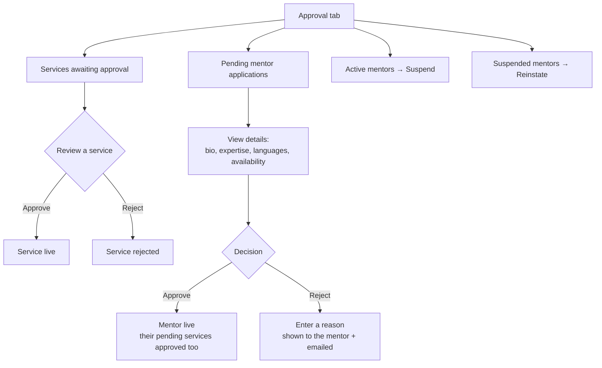
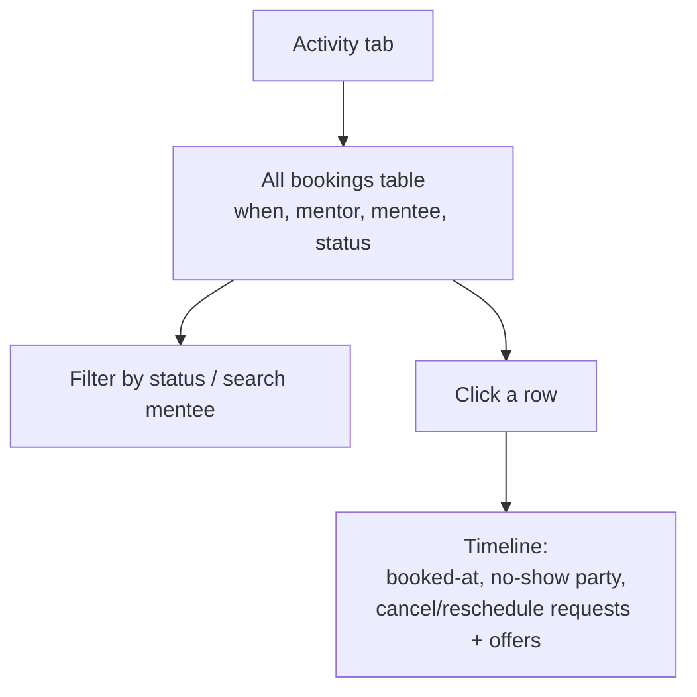
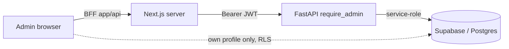

# Admin flows

Admin = `yokeshmd99@gmail.com` (auto-assigned the admin role on signup). Two tabs: **Approval** and **Activity**.

## Approval tab — mentors + services

## Activity tab — booking oversight

## Where the data comes from (trust boundary)

