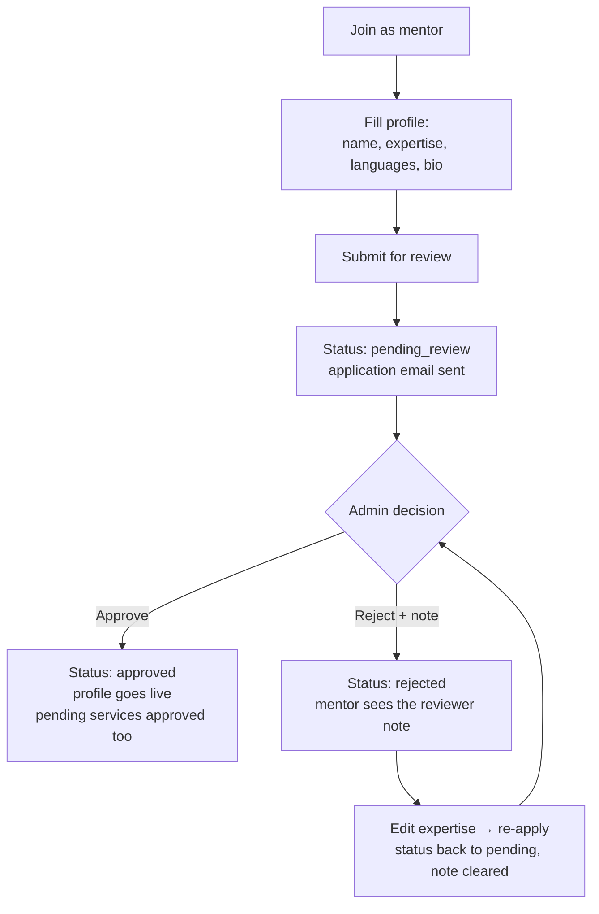
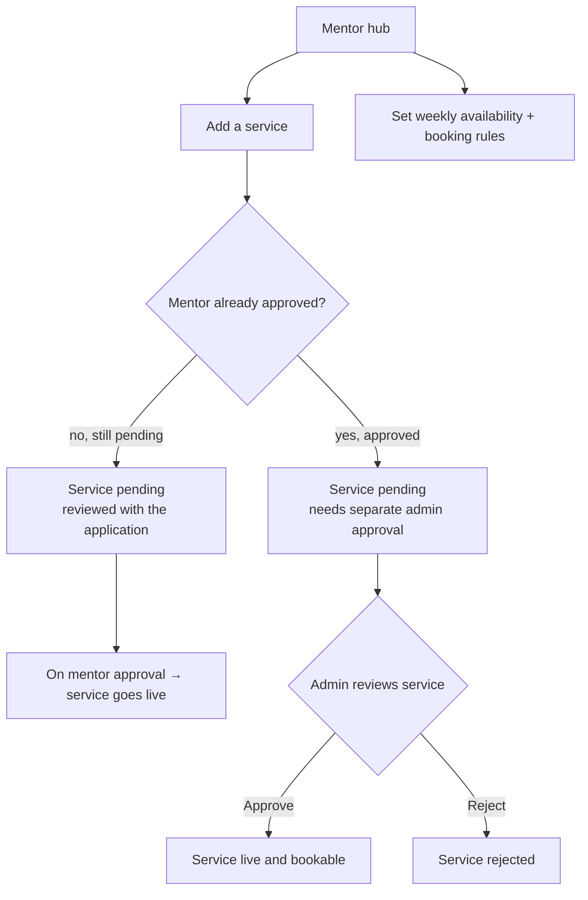
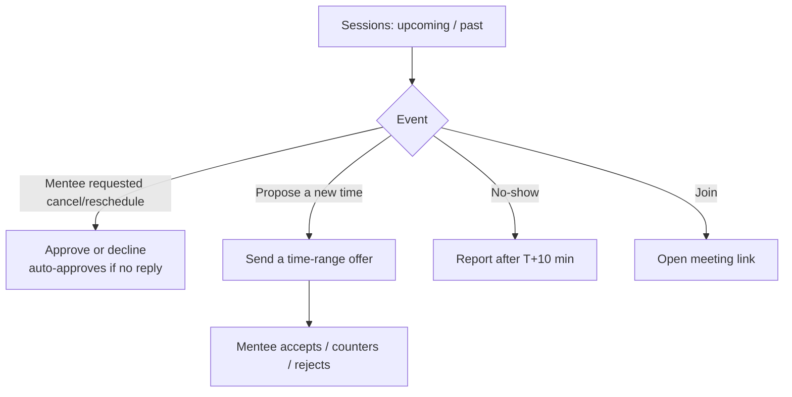

# Mentor flows

## Become a mentor → approval

```mermaid
flowchart TD
  A[Join as mentor] --> B[Fill profile:<br/>name, expertise, languages, bio]
  B --> C[Submit for review]
  C --> D[Status: pending_review<br/>application email sent]
  D --> E{Admin decision}
  E -->|Approve| F[Status: approved<br/>profile goes live<br/>pending services approved too]
  E -->|Reject + note| G[Status: rejected<br/>mentor sees the reviewer note]
  G --> H[Edit expertise → re-apply<br/>status back to pending, note cleared]
  H --> E
```

## Set up services + availability (allowed while pending)

```mermaid
flowchart TD
  A[Mentor hub] --> B[Add a service]
  B --> C{Mentor already approved?}
  C -->|no, still pending| D[Service pending<br/>reviewed with the application]
  C -->|yes, approved| E[Service pending<br/>needs separate admin approval]
  D --> F[On mentor approval → service goes live]
  E --> G{Admin reviews service}
  G -->|Approve| H[Service live and bookable]
  G -->|Reject| I[Service rejected]
  A --> J[Set weekly availability + booking rules]
```

## Manage sessions

```mermaid
flowchart TD
  A[Sessions: upcoming / past] --> B{Event}
  B -->|Mentee requested cancel/reschedule| C[Approve or decline<br/>auto-approves if no reply]
  B -->|Propose a new time| D[Send a time-range offer]
  D --> E[Mentee accepts / counters / rejects]
  B -->|No-show| F[Report after T+10 min]
  B -->|Join| G[Open meeting link]
```
