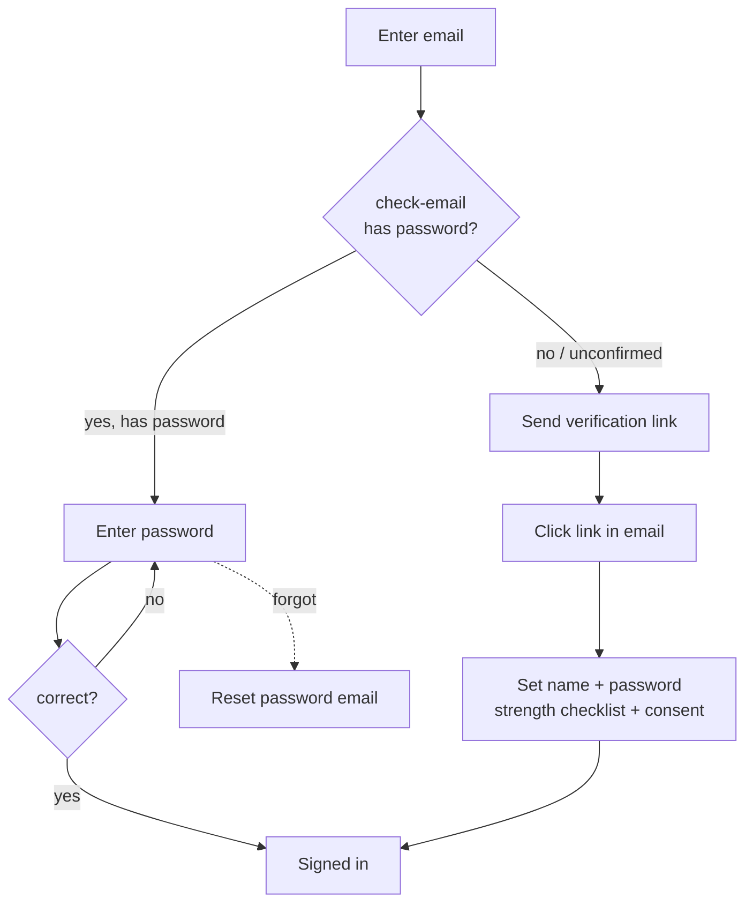
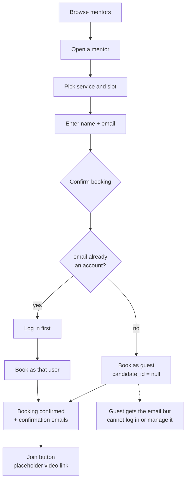
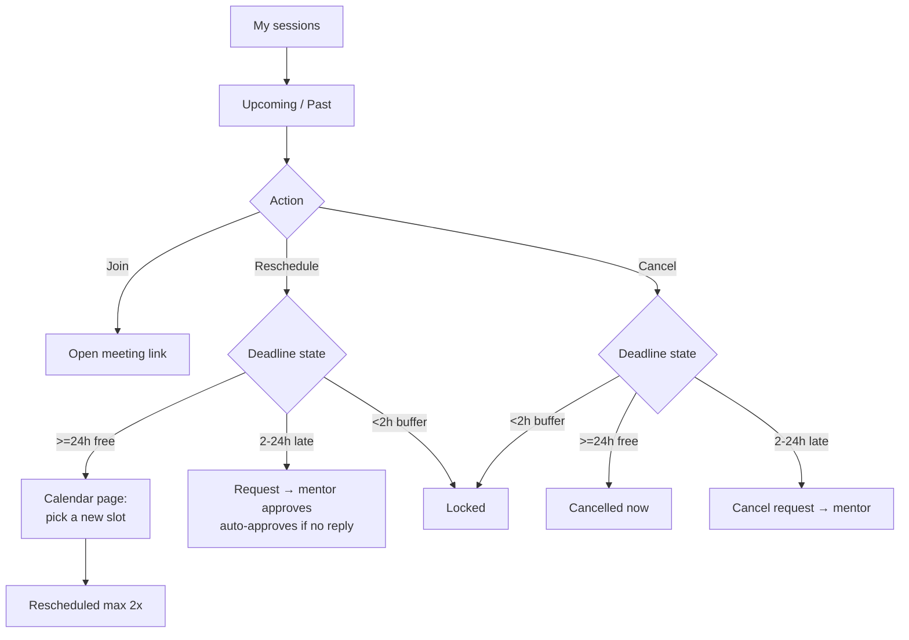

# User (mentee) flows

Rendered by GitHub automatically. Edit the text to update the diagram.

## Sign up / log in

```mermaid
flowchart TD
  A[Enter email] --> B{check-email<br/>has password?}
  B -->|yes, has password| C[Enter password]
  C --> D{correct?}
  D -->|yes| E[Signed in]
  D -->|no| C
  C -.forgot.-> R[Reset password email]
  B -->|no / unconfirmed| F[Send verification link]
  F --> G[Click link in email]
  G --> H[Set name + password<br/>strength checklist + consent]
  H --> E
```

## Book a mentor (member or guest)

```mermaid
flowchart TD
  A[Browse mentors] --> B[Open a mentor]
  B --> C[Pick service and slot]
  C --> D[Enter name + email]
  D --> E{Confirm booking}
  E --> F{email already<br/>an account?}
  F -->|yes| G[Log in first]
  G --> H[Book as that user]
  F -->|no| I[Book as guest<br/>candidate_id = null]
  H --> J[Booking confirmed<br/>+ confirmation emails]
  I --> J
  J --> K[Join button<br/>placeholder video link]
  note1[Guest gets the email but<br/>cannot log in or manage it]
  I -.-> note1
```

## View / manage my sessions

```mermaid
flowchart TD
  A[My sessions] --> B[Upcoming / Past]
  B --> C{Action}
  C -->|Join| J[Open meeting link]
  C -->|Reschedule| D{Deadline state}
  C -->|Cancel| E{Deadline state}
  D -->|>=24h free| F[Calendar page:<br/>pick a new slot]
  D -->|2-24h late| G[Request → mentor approves<br/>auto-approves if no reply]
  D -->|<2h buffer| H[Locked]
  E -->|>=24h free| I[Cancelled now]
  E -->|2-24h late| K[Cancel request → mentor]
  E -->|<2h buffer| H
  F --> L[Rescheduled max 2x]
```
